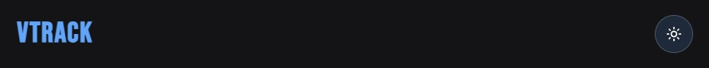

## Banner

---

# VTrack – Simple Voice Tracker for Public Speaking

VTrack is a lightweight **Next.js** application designed to help you monitor your speaking sessions in real time. Inspired by *Talk Like TED*, it lets you track your speaking pace, active time, and live transcript.

---

## Features

- **Words Per Minute (WPM):** Measure your speaking speed accurately.  
- **Active vs Total Time:** Track how much time you’re actively speaking versus total session duration.  
- **Live Transcript:** View your spoken words as text in real time.  
- **Start/Stop Recording:** Easily control your session with intuitive buttons.  
- **Reset & Copy:** Clear your session or copy the transcript to clipboard.  
- **Light/Dark Mode:** Theme support based on system preference or manual toggle.  

---

